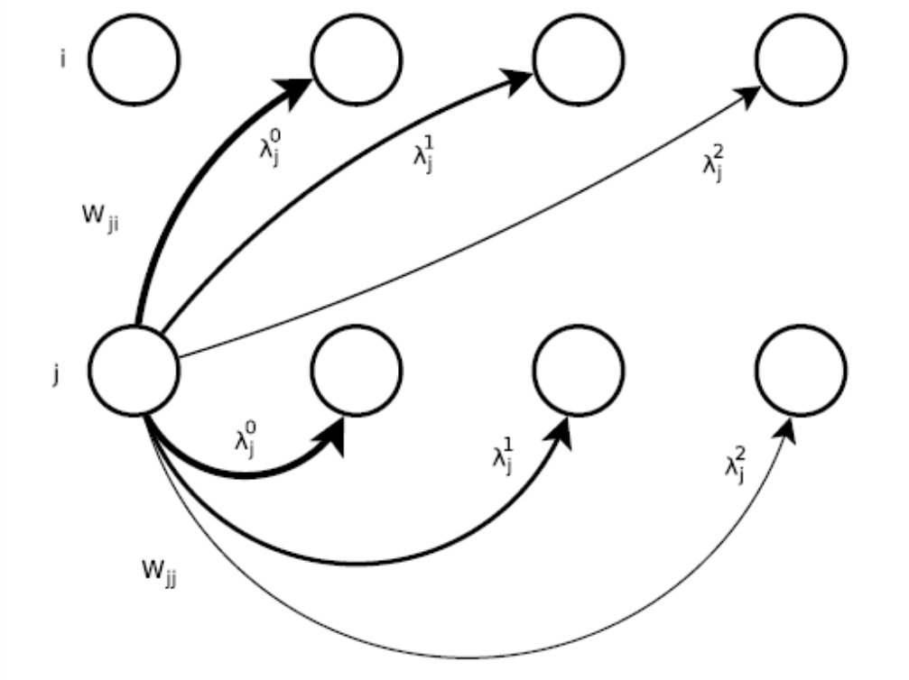
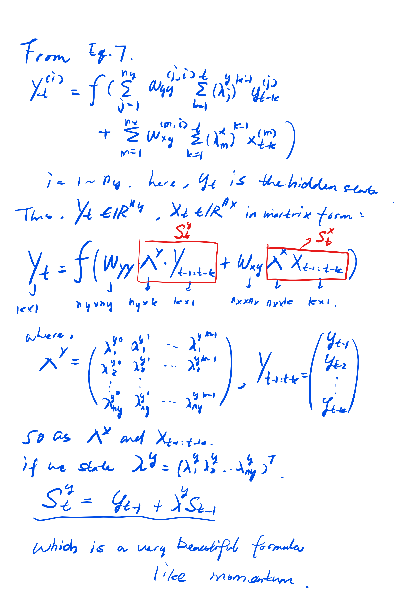

[Temporal-Kernel Recurrent Neural Networks](http://www.sciencedirect.com/science/article/pii/S0893608009002664)

Though the second author is Geoff Hinton, this work reports TKRNN is only comparable with LSTM in their experinment (means it cannot win). Besides, the work is in 2009, thus the task seems not difficult enough. I don't know why their work uses rarely the matrix representation, making it really consufing to understand. However, this work is more biologically plausible, since it uses the idea of "[leaky intergrator](https://en.wikipedia.org/wiki/Leaky_integrator)", which means the previous hidden states' influence flows degeneratively, and the gradients will get the skip connections from far steps.

The following shows my derivation of matrix form:

