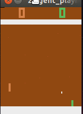

# Advanced Machine Learning Study Plan
This list mainly focuses on Bayesian Machine Learning.

## Doing

### Study
* CMU 10-708 PGM (19) by Eric Xing ([website](https://sailinglab.github.io/pgm-spring-2019/))
  * [ ] Lecture 1
  * [ ] Lecture 2
  * [ ] Lecture 3
  * [ ] Lecture 4
  * [ ] Lecture 5
  * [ ] Lecture 6
  * [ ] Lecture 7
  * [ ] Lecture 8

* [ ] CS231A: CS231A: Computer Vision, From 3D Reconstruction to Recognition (no video) ([syllabus](http://web.stanford.edu/ class/cs231a/syllabus.html)) ([notes](http://web.stanford.edu/class/cs231a/course_notes.html))
  * [ ] Lecture 1 & 2 Introduction & Camera Models
  * [ ] Lecture 3 Camera Models II and Camera Calibration
  * [ ] TA 1 Problem Set 1 Review
  * [ ] Note 1 Camera Models

## Practice
* [ ] MNIST from scratch ([ref](https://github.com/eriklindernoren/ML-From-Scratch/tree/master/mlfromscratch/deep_learning))
* [ ] Finding the suspect: BMML final project ([Coursera](https://www.coursera.org/learn/bayesian-methods-in-machine-learning/home/welcome))
* [ ] Classification setting + DNI
* [ ] STN + 3D STN
* [ ] TSP 
    * [ ] Learning Combinatorial Optimization Algorithms over Graphs ([NIPS](https://papers.nips.cc/paper/7214-learning-combinatorial-optimization-algorithms-over-graphs.pdf))
    * [ ] Neural Combinatorial Optimization with Reinforcement Learning ([arXiv](https://arxiv.org/abs/1611.09940)) ([code](https://github.com/pemami4911/neural-combinatorial-rl-pytorch))
    * [ ] Attention Solves Your TSP ([arXiv](https://arxiv.org/abs/1803.08475)) ([code](https://github.com/wouterkool/attention-tsp))

## Study
* [ ] Interpretable Machine Learning book ([link](https://christophm.github.io/interpretable-ml-book/index.html))
* Bayesian Machine Learning
    * [ ] [MLaPP](https://www.cs.ubc.ca/~murphyk/MLbook/)
    * [ ] CMU PGM by Eric Xing
        * [ ] Models, Bayesian non-param and some other basics ([10708-14](http://www.cs.cmu.edu/~epxing/Class/10708-14/lecture.html))
        * [ ] Homeworks and Solutions ([10708-16](http://www.cs.cmu.edu/~epxing/Class/10708-16/homework.html)) 
        * [ ] Advance ([10708-17](http://www.cs.cmu.edu/~epxing/Class/10708-17/lecture.html)) 
* Reinforcement Learning
    * [ ] Deep RL Bootcamp ([Berkeley](https://sites.google.com/view/deep-rl-bootcamp/home))
    * [ ] Practical RL ([github](https://github.com/duducheng/Practical_RL))
* [ ] Learn from Top Kagglers ([Coursera](https://www.coursera.org/learn/competitive-data-science/home/welcome))
* [ ] Learning Discrete Latent Structure ([UoT](https://duvenaud.github.io/learn-discrete/)) 

## Done
* [x] CS231n 2017 ([Stanford](http://cs231n.stanford.edu/syllabus.html))
* [x] ADLxMLDS ([17](https://www.csie.ntu.edu.tw/~yvchen/f106-adl/syllabus)) ([16](http://speech.ee.ntu.edu.tw/~tlkagk/courses_MLDS17.html))
* [x] [Atari Game Playing](https://www.csie.ntu.edu.tw/~yvchen/f106-adl/A3) @[my fork of `Practical-RL`](https://github.com/duducheng/Practical_RL/tree/master/workspace) 
    * 
* [x] Pointer Network in PyTorch
* [x] DeepLabv3+ Pascal Voc2012 Segmentation with Gluon 

